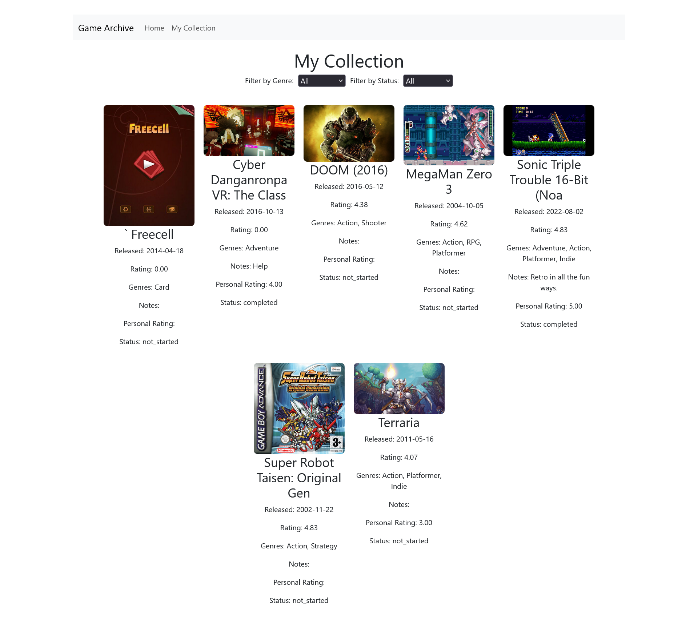

# The Game Archive
A one-stop solution for managing your personal game collection. This application allows users to search for games, add them to their collection, update game details, and filter games by genre and status.

---

## Screenshots
### Home Page


### Collection Page


### Game Modal


---

## Design

### Database Design
The database is designed with three main tables: `games`, `categories`, and `jnct_game_category`. Below is the schema:


#### Tables:
1. **`games`**:
   - Stores information about each game (that are saved to the Collection), including title, description (unused), release date, rating, personal rating, notes, and status.
   - Includes a `background_image` field for storing the game's image URL.

2. **`categories`**:
   - Stores the list of game genres (e.g., Adventure, Action, RPG) and an ID for each one (these do no correlate to the RAWG genre ID, which are instead mapped inside App.tsx). There are 19 Genres.

3. **`jnct_game_category`**:
   - A junction table that links games to their respective genres, consisting only of two foreign keys linking a given game to a genre (a game can have many genres).

#### Schema:
```sql
CREATE TABLE `games` (
  `id` int(11) NOT NULL,
  `title` varchar(32) NOT NULL,
  `description` text DEFAULT NULL,
  `release_date` date NOT NULL DEFAULT current_timestamp(),
  `rawg_id` int(11) NOT NULL,
  `rating` decimal(3,2) DEFAULT NULL,
  `status` enum('not_started','playing','completed','on_hold','dropped') NOT NULL DEFAULT 'not_started',
  `personal_rating` decimal(3,2) DEFAULT NULL,
  `notes` text DEFAULT NULL,
  `background_image` varchar(255) NOT NULL
) ENGINE=InnoDB DEFAULT CHARSET=utf8mb4 COLLATE=utf8mb4_general_ci;

CREATE TABLE `categories` (
  `id` int(11) NOT NULL,
  `name` varchar(32) NOT NULL
) ENGINE=InnoDB DEFAULT CHARSET=utf8mb4 COLLATE=utf8mb4_general_ci;

INSERT INTO `categories` (`id`, `name`) VALUES
(1, 'Adventure'),
(2, 'Action'),
(3, 'RPG'),
(4, 'Shooter'),
(5, 'Puzzle'),
(6, 'Strategy'),
(7, 'Sports'),
(8, 'Fighting'),
(9, 'Simulation'),
(10, 'Platformer'),
(11, 'Arcade'),
(12, 'Racing'),
(13, 'Indie'),
(14, 'Casual'),
(15, 'MMO'),
(16, 'Family'),
(17, 'Board'),
(18, 'Card'),
(19, 'Educational');

CREATE TABLE `jnct_game_category` (
  `game_FK` int(11) NOT NULL,
  `category_FK` int(11) NOT NULL
) ENGINE=InnoDB DEFAULT CHARSET=utf8mb4 COLLATE=utf8mb4_general_ci;
```

### Frontend Design
The frontend was made after looking into the RAWG API design, split into two sections: search and collection. Both files make requests to the , both GET and POST requests and leaving all backend requests to both the API and database through the PHP server.
#### App.tsx
The homepage offers a search function with a few different options: title or genre search (and a follow up textbox or genre dropdown), and sorting results alphabetically or by rating (out of 5). Then the search will make a GET request for a page of 9 results, following up with another page whenever the next page button is pressed at the bottom of the screen. This then allows the user to opena modal of any shown games and see their info or add them to their collection, which generates a POST request to the PHP server.
##### App Fetch
```js
fetch(
      `http://localhost:8000/script.php?action=search&query=${encodeURIComponent(searchQuery)}&type=${searchType}&page=${page}&sort=${sortType}`
    )
```
```js
fetch(`http://localhost:8000/script.php?action=genreSearch&genre_id=${genreId}&page=${page}&sort=${sortType}`)
```
```js
fetch('http://localhost:8000/script.php', {
      method: 'POST',
      headers: { 'Content-Type': 'application/json' },
      body: JSON.stringify({ action: 'save', game }),
    })
```
#### Collection.tsx
Collection starts with a GET request to retrieve all saved games with the filters `genre` and `status` defaulting to all. You can choose any of the 19 genres and also filter by game status (a saved game defaults to `non_started`) with the options `not_started, completed, playing, on_hold, dropped`. When clicking on a game you open a modal that will show more details, allow you to edit `notes`, `status`, and `personal_rating` in a POST request or delete the game from your collection with a different POST request.
##### Collection Fetch
```js
fetch('http://localhost:8000/script.php?action=getCollection')
```
```js
fetch('http://localhost:8000/script.php', {
      method: 'POST',
      headers: { 'Content-Type': 'application/json' },
      body: JSON.stringify({ action: 'delete', game_id: gameId }),
    })
```
```js
fetch('http://localhost:8000/script.php', {
      method: 'POST',
      headers: { 'Content-Type': 'application/json' },
      body: JSON.stringify({ action: 'update', game: selectedGame }),
    })
```

### Backend Design (PHP Server)
#### General Desing
The format to PHP requests take `GET/POST` and then the `action` specifies what is being done, having the options:
```
GET: search, genreSearch, getCollection
POST: save, delete, update
```
With `search` and `genreSearch` being API requests rather than SQL queries. For GETS we need to set information after making a fetch, as seen below
```php
foreach ($data['results'] as $game) {
        $simplified[] = [
            'id' => $game['id'],
            'name' => $game['name'],
            'released' => $game['released'] ?? 'Unknown', // Default to 'Unknown' if not set
            // 'description' => $game['description'] ?? 'No description available.', // Default to placeholder
            'rating' => $game['rating'] ?? 0, // Default to 0 if not set
            'background_image' => $game['background_image'] ?? '', // Default to empty string if not set
            'genres' => array_map(fn($genre) => $genre['name'], $game['genres'] ?? []), // Handle missing genres
        ];
    }
```

## How To Use
### Prerequisites
XAMPP or any other PHP and MySQL server tools.
Install Node.js for running the React frontend.

### Setup
#### Import the Database
Use the [SQL](gamearchive.sql) file to import the Game Archive database with MySQL. If you used XAMPP, you can go to phpMyAdmin and import there, just do not change anything in the file (do not touch the categories data, as it is contant information referenced by the software.)

### Prepare the Backend
This is where  is used and run on a PHP server. However you intend to start it, you will most likely use the following command `php -S localhost:8000` while in `GameArchive\backend`to ensure it is on the correct port for the system.
If, for whatever reason, port 8000 is not available: go through  and  and change fetch requests from `8000` to whatever port you use.

### Prepare the Frontend
Go into the GameArchive directory in your terminal (or VSCode if you are running the system through it) and then run
```
npm install
npm install bootstrap
npm run dev
```
and follow the posted link to a localhost port. In my testing, it was .
